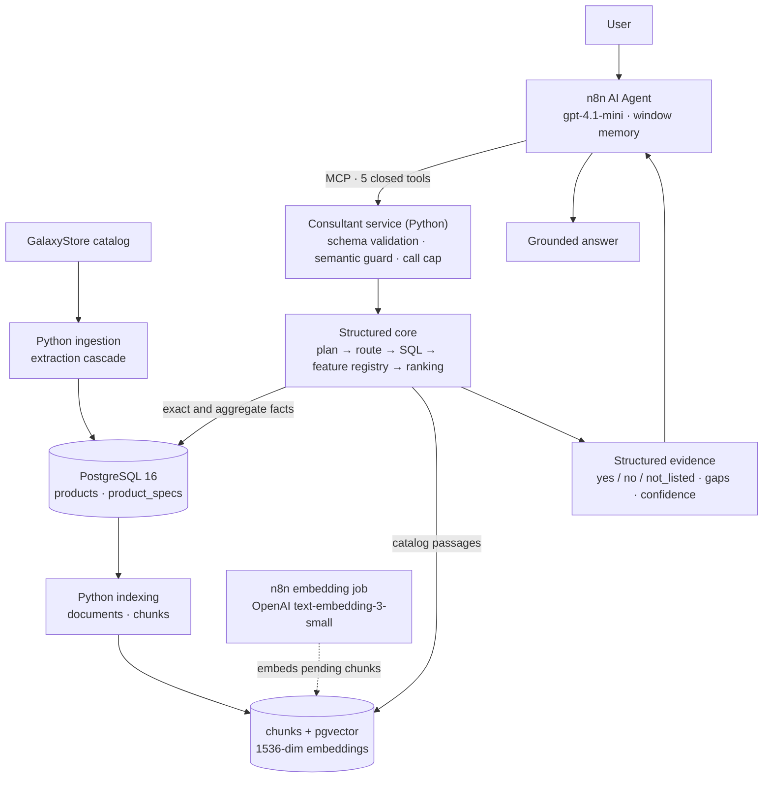

# Samsung AI Consultant

A production-like AI product consultant for Samsung TVs, built on a real commercial catalog. A user asks in plain
Russian («посоветуйте телевизор под PS5, 55 дюймов, до 150 тысяч»); the consultant answers with real models,
current prices and availability, and says «в каталоге нет данных» where the catalog is silent.

**Status: backend MVP complete.** Ready for a portfolio or controlled client demo, with one documented
conversational limitation. Strict production acceptance is on hold ([Project status](#project-status)).

## What it is

- **Real catalog ingestion**: the GalaxyStore Samsung TV catalog, 75 products and 4 151 specification rows.
- **PostgreSQL structured storage**: typed product columns plus a long-tail specification table.
- **pgvector semantic index**: 514 chunks with 1536-dimension embeddings, built incrementally.
- **Tool-using LLM agent**: five closed, typed catalog tools; the model never writes SQL and never sees a vector.
- **Multi-turn conversations**: constraints stated earlier are carried, replaced and released.
- **Deterministic validation**: closed argument schemas, a semantic guard, a per-turn tool-call cap.
- **n8n orchestration**: the chat agent and the embedding job run in n8n; catalog truth stays in Python and PostgreSQL.
- **Formal evaluation**: retrieval benchmark, agent evaluation, a model bake-off, a 15-scenario product acceptance
  run and an 8-conversation demo suite, all with committed evidence.

## Business problem

An LLM on its own does not know a shop's current catalog. Asked about prices, stock or specifications, it answers
from stale training data and fills the gaps with plausible inventions. For a product consultant that is a wrong
price, a model that does not exist, or a feature the TV does not have.

The system therefore separates four things that a plain chatbot mixes:

| Concern | Owner |
|---|---|
| Structured facts (price, size, panel, availability, specifications) | PostgreSQL, read through typed SQL |
| Catalog text for open questions | chunks with pgvector embeddings |
| Which products match, in which order | deterministic Python tools |
| Understanding the request, asking, explaining | the LLM |

> The LLM is not the source of catalog truth. Structured tools and retrieved evidence are.

## Architecture



n8n orchestrates: it hosts the agent, its memory and the embedding job. It does not build documents and is not a
source of truth. The full description is in [docs/ARCHITECTURE.md](docs/ARCHITECTURE.md).

## Data pipeline

```text
GalaxyStore → deterministic extraction cascade → normalized PostgreSQL
            → documents / chunks → incremental embeddings → retrieval → Consultant
```

- **Extraction cascade**: four structured sources per page, in a fixed order (`JSON-LD` → `digitalData` →
  `SM_PARAMS` → an HTML fallback). No LLM is involved in ingestion.
- **Idempotent**: a product is identified by `(source, external_id)`; a second crawl of the same catalog yields the
  same 75 products, with no duplicates.
- **One document per product, up to seven chunks** (overview, display, gaming, audio, smart features, connectivity,
  physical design), built by deterministic formatting of the stored rows.
- **Embedding-aware incremental sync**: a rebuild never pays for an embedding twice.

| Chunk after a rebuild | Stored vector |
|---|---|
| same `content_hash` | preserved |
| changed `content_hash` | reset, embedded again by the next job run |
| new chunk | pending |
| chunk no longer produced | deleted |

## Agent architecture

- **Closed tool set**: `search_tvs`, `get_tv`, `compare_tvs`, `recommend_tvs`, `get_catalog_stats`. Each has a closed
  JSON Schema; unknown fields and wrong types are rejected, never coerced. There is no SQL, filter-expression,
  vector or ranking argument anywhere in the tool surface.
- **SQL for exact and aggregate facts**: lists, lookups, comparisons, counts and extremes come from typed queries
  over the structured tables. The retrieval benchmark showed why: SQL answered 7 of 7 structured cases exactly,
  while vector search alone put the right product in the top five in 1 of 6 semantic cases.
- **Semantic layer as evidence, not selection**: chunks supply the catalog passages that support an answer about a
  named product. Vector and hybrid routes exist in the core and were evaluated; the deployed service does not
  generate query embeddings, so product selection is always structured.
- **Three-state features**: 14 registry features (120 Hz, VRR, HDMI 2.1, Dolby Atmos, …) are reported per product as
  `yes`, `no` or `not_listed`. `not_listed` means the catalog has no data, and the agent says so.
- **Deterministic ranking** for recommendations, by use case (gaming, movies, sound, bright room, thin wall, compact).
- **Multi-turn memory**: a six-turn window per session in n8n.
- **Semantic guard**: before a tool runs, a price, size, refresh-rate or required-feature argument that no user
  message states is removed, so an invented filter never reaches the catalog. At most three tool calls per message.

Unsupported numeric constraints are **not** fully solved. The guard keeps an invented number out of the query, but
after a vague or relative request («подешевле», «не огромный») the model may still put a threshold it inferred
itself into the answer text («до 50 000 ₽»). See [Known limitations](#known-limitations).

## Evaluation

| Stage | What was measured | Result |
|---|---|---|
| Retrieval (Phase 3D) | 21 cases against the production catalog: SQL, vector, hybrid | SQL exact on structured and aggregate cases; vector alone weak at selecting products. This decided the architecture |
| Agent (Phase 4D–4E) | 42 cases through the live n8n agent | 40 of 42 cases, 0 incorrect product facts; the semantic guard was added and confirmed live |
| Model bake-off | `gpt-4.1-mini`, `gpt-4o-mini`, `gpt-4.1` on the frozen runtime, 246 scored turns | `gpt-4.1-mini` kept |
| Product acceptance (Phase 4F.2) | 15 realistic multi-turn scenarios, strict rubric, manual review | **HOLD**: 4 of 15 scenarios passed |
| MVP demo (Phase 4F.3) | 3 targeted fixes, then 8 demo conversations | **7 of 8 pass** |
| Hotfix (Phase 4F.3A) | reject-and-retry for an invented number | failed live verification, reverted |

The 7 of 8 is a demo result. It is not strict production acceptance, which remains on hold.

What held in the final tested build (`samsung-consultant:4f3f`):

- no invented product or model code, no invented price, no invented availability;
- hard constraints respected: no product outside the stated panel, size, budget or availability;
- multi-turn constraint memory: constraints carried, replaced and released correctly;
- explicit feature evidence: a feature that is asked about is always shown as `yes`, `no` or unknown, which removed
  the unsupported «с поддержкой HDMI 2.1» claims of the acceptance run;
- exact aggregates: «сколько моделей с Dolby Atmos» is answered from a feature count (54 of 66 available), not
  from the size of a list.

The one primary MVP limitation is the invented numeric threshold described above: it fails the eighth demo
conversation. Evidence for every stage is committed: [evaluation/README.md](evaluation/README.md).

## Demo examples

Full transcripts with tool calls, guard decisions and the reviewer's verdict:

| Conversation | Shows |
|---|---|
| [Basic recommendation](evaluation/results/phase_4f_3_demo/transcripts/DEMO-01.md) | filtering by size and budget, a short list of real models |
| [Gaming / PS5](evaluation/results/phase_4f_3_demo/transcripts/DEMO-02.md) | gaming evidence per model; the HDMI version reported as not listed |
| [Movies + sound](evaluation/results/phase_4f_3_demo/transcripts/DEMO-03.md) | a clarifying question, then technology, use and sound together |
| [Changed hard constraint](evaluation/results/phase_4f_3_demo/transcripts/DEMO-05.md) | size replaced, technology and budget kept, a new budget applied |
| [Direct comparison](evaluation/results/phase_4f_3_demo/transcripts/DEMO-06.md) | factual differences of two models, no invented superiority |
| [Missing attribute](evaluation/results/phase_4f_3_demo/transcripts/DEMO-07.md) | an honest «нет данных» for brightness in nits |
| [Aggregate question](evaluation/results/phase_4f_3_demo/transcripts/DEMO-08.md) | exact counts with their scope |

The failed conversation is in the same directory
([report](evaluation/results/phase_4f_3_demo/PHASE_4F_3_MVP_DEMO_REPORT.md)).

## Engineering highlights

- Idempotent catalog ingestion with a canonical `(source, external_id)` product identity.
- Incremental RAG indexing that preserves embeddings across rebuilds.
- PostgreSQL + pgvector in one database; SQL and vector retrieval kept as separate, explicit routes.
- Closed LLM tools: the model chooses a domain operation, Python decides how it is executed.
- Evidence-aware feature handling: unknown is a first-class state, never silently «нет» or «да».
- Multi-turn state with a guard that checks every hard constraint against what the user actually said.
- Deterministic evaluation harnesses: reports are generated from committed evidence, and a `--check` fails when a
  generated file is stale.
- Production safety gates: least-privilege database roles, a read-only consultant session, an internal-only
  service with no published port, secrets never in the repository.
- Reproducible deployment: an image built from a committed revision, compared file by file with the repository.
- Automated tests: 893 unit tests and 148 database tests on a disposable PostgreSQL + pgvector container.

## Tech stack

Python 3 · PostgreSQL 16 · pgvector 0.8 · OpenAI embeddings (`text-embedding-3-small`) · OpenAI LLM
(`gpt-4.1-mini`) · n8n (AI Agent, MCP client) · Model Context Protocol over HTTP · Docker / Compose · pytest

## Known limitations

- **Strict production acceptance is not passed** (Phase 4F.2: HOLD).
- **Vague relative numeric requests**: after «подешевле» or «не огромный» the answer may state a numeric threshold
  the user never gave. The threshold is not applied to the query, so the products are right; the wording is not.
- **The source catalog lacks some attributes**, such as measured brightness; the consultant says so instead of guessing.
- **Qualitative claims** («лучше для кино») need stronger evidence than structured catalog fields provide.
- **One commercial source**: the catalog is a single shop's Samsung TV listing.

## Project status

| | |
|---|---|
| Backend MVP | **complete**, frozen |
| Portfolio / client demo | **ready**, with the documented limitation |
| Strict production acceptance | **HOLD** |

Closure record, accepted runtime and rollback: [docs/PROJECT_CLOSURE.md](docs/PROJECT_CLOSURE.md).

## Repository layout

```text
projects/samsung-ai-consultant/
├── ingestion/    # GalaxyStore catalog → PostgreSQL
├── db/           # schema, migrations, database tests
├── indexing/     # documents and chunks builder, embedding-aware sync
├── consultant/   # structured core, tools, semantic guard, MCP server, agent prompt
├── workflows/    # n8n workflows as code: embedding job, consultant agent
├── deploy/       # consultant container, runbook, probes
├── evaluation/   # datasets, harnesses, results and transcripts
├── tests/        # unit and database tests
└── docs/         # architecture, closure, phase records, ADRs
```

## Documentation

| Document | Contents |
|---|---|
| [docs/ARCHITECTURE.md](docs/ARCHITECTURE.md) | the accepted architecture, end to end |
| [docs/PROJECT_CLOSURE.md](docs/PROJECT_CLOSURE.md) | final status, accepted runtime, rollback, optional future work |
| [docs/adr/](docs/adr/) | four decision records: storage, chunking, embedding-aware sync, agent boundary |
| [evaluation/README.md](evaluation/README.md) | datasets, harnesses and where each result lives |
| [deploy/consultant/README.md](deploy/consultant/README.md) | deployment runbook and rollback |
| [ingestion/](ingestion/README.md), [indexing/](indexing/README.md), [db/](db/README.md), [workflows/](workflows/README.md) | component documentation |
| `docs/PHASE_*.md`, [docs/MODEL_BAKEOFF.md](docs/MODEL_BAKEOFF.md) | the phase-by-phase engineering record, kept as written |
