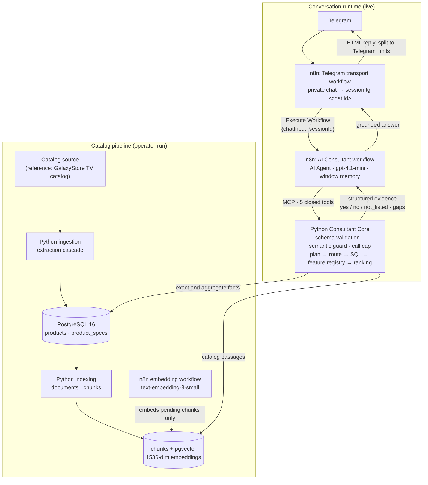

# AI Catalog Consultant

A production-like AI product consultant built on a real e-commerce catalog. The system combines deterministic
ingestion, PostgreSQL, structured retrieval, semantic evidence, pgvector, closed LLM tools, MCP and n8n
orchestration. A user asks in plain Russian («посоветуйте телевизор под PS5, 55 дюймов, до 150 тысяч»); the
consultant answers with real models, current prices and availability, and says «в каталоге нет данных» where the
catalog is silent.

**Status: completed portfolio MVP and reference implementation.** The consultant runs live behind a Telegram bot and
was accepted by the project owner after live testing. A stricter experimental acceptance suite (Phase 4F.2) found one
conversational limitation. It is documented under [Known limitations](#known-limitations) and deliberately left
unfixed ([Project status](#project-status)).

**Reference dataset.** The deployed catalog is a real retailer's TV listing: the GalaxyStore Samsung TV catalog, 75
products and 4 151 specification rows. The architecture is not tied to one brand. The current implementation is
tied to TVs, though: its feature registry, filters and ranking rules are TV-specific. The project started out as a
TV-catalog consultant and is now presented as AI Catalog Consultant
([what is reusable and what is TV-specific](#scope-reference-implementation-vs-generalization)).

## What it is

- **Deterministic catalog ingestion**: a fixed extraction cascade over the source pages, with no LLM in the loop.
- **PostgreSQL structured storage**: typed product columns plus a long-tail specification table.
- **pgvector semantic index**: 514 chunks with 1536-dimension embeddings, indexed incrementally.
- **Tool-using LLM agent**: five closed, typed catalog tools; the model never writes SQL and never sees a vector.
- **MCP tool boundary**: the agent reaches the Python Consultant Core only through the Model Context Protocol.
- **Multi-turn conversations**: constraints from earlier in the chat are carried over, replaced and released.
- **Deterministic validation**: closed argument schemas, a semantic guard, and a cap on tool calls per turn.
- **n8n orchestration**: the Telegram transport, the chat agent and the embedding job run in n8n. Catalog truth
  stays in Python and PostgreSQL.
- **Formal evaluation**: a retrieval benchmark, an agent evaluation, a model bake-off, a 15-scenario product
  acceptance run and an 8-conversation demo suite, all with committed evidence.

## Business problem

On its own, an LLM does not know a shop's current catalog. Asked about prices, stock or specifications, it answers
from stale training data and fills the gaps with plausible inventions. For a product consultant that means a wrong
price, a model that does not exist, or a feature the product does not have. Catalog facts change every week, and
a hallucinated price or specification is not an acceptable failure.

## Solution

The system keeps apart four things that a plain chatbot mixes together:

| Concern | Owner |
|---|---|
| Structured facts (price, size, panel, availability, specifications) | PostgreSQL, read through typed SQL |
| Catalog text for open questions | documents and chunks, with pgvector embeddings |
| Which products match, and in which order | deterministic Python tools |
| Understanding the request, asking, explaining | the LLM |

> The LLM is not the source of catalog truth. Structured tools and retrieved evidence are.

Every step before the LLM is deterministic, and each has its own owner:

1. **Ingestion** reads the source catalog into normalized `products` / `product_specs` rows.
2. **Indexing** formats those rows into one document per product, split into section chunks.
3. **Embeddings** are written incrementally, only for new or changed chunks.
4. **Structured retrieval** selects, filters, counts and ranks products with SQL and a feature registry.
5. **Semantic evidence** supplies the catalog passages that support an answer about a named product.
6. **The LLM** interprets the request, chooses a closed tool and words the answer from the returned evidence.

## Architecture



| Component | Responsibility | Not its responsibility |
|---|---|---|
| **Python** (`ingestion/`, `indexing/`, `consultant/`) | domain and core logic: extraction, normalization, documents and chunks, SQL, feature registry, ranking, the guard | conversation wording |
| **PostgreSQL + pgvector** | the catalog truth: products, specifications, documents, chunks, vectors | business logic |
| **MCP** | the controlled tool boundary: five closed JSON Schemas, bearer authentication, an internal-only service | anything the schemas do not allow |
| **n8n** | orchestration and integration: the Telegram channel, the agent and its session memory, the embedding job | building documents, storing facts |
| **LLM** | interpreting the request, choosing a tool, asking, explaining | catalog facts, SQL, ranking |

The LLM never writes SQL. n8n never builds documents and is not a source of truth: the integration boundary
between the catalog pipeline and n8n is the database. The Consultant Core is a plain Python service behind MCP, so
another channel or orchestrator could call it the same way. The deployed reference runtime uses n8n, and no
other channel is implemented. The full description is in [docs/ARCHITECTURE.md](docs/ARCHITECTURE.md).

## Scope: reference implementation vs. generalization

| Reusable architecture (implemented here) | Specific to the current reference implementation |
|---|---|
| deterministic ingestion into typed columns plus a long-tail spec table | the GalaxyStore extractors (`JSON-LD`, `digitalData`, `SM_PARAMS`, HTML) |
| one document per product, section chunks, embedding-aware incremental sync | the seven TV sections (display, gaming, audio, …) |
| closed, typed tools behind MCP; structured selection, semantic evidence | the tool set (`search_tvs`, `get_tv`, …) and the TV filters |
| three-state feature evidence (`yes` / `no` / `not_listed`) | the 14 TV features (120 Hz, VRR, HDMI 2.1, Dolby Atmos, …) and the use-case ranking rules |
| a semantic guard that drops hard constraints the user never stated | price, size and refresh-rate constraints |
| a thin channel transport in front of the agent | Telegram |

Supporting another catalog would mean new extractors, a new section and feature vocabulary, and new tool schemas.
The storage, indexing, tool boundary, guard and evaluation approach would carry over. The repository does **not**
implement arbitrary catalogs, schema mapping, other source types (CSV, CRM, ERP, client databases), multi-tenancy or
other chat channels.

## Updating the catalog

The catalog is refreshed by the operator in three steps: ingestion, indexing, then embeddings. Each step is
idempotent, and only changed content gets new embeddings.

```text
catalog source
    ↓  python -m ingestion run            (Python, operator)
products / product_specs                  upserted; specs replaced per product
    ↓  python -m indexing build           (Python, operator)
documents / chunks                        only new or changed chunks get embedding = NULL
    ↓  "Samsung — RAG Indexing" workflow  (n8n, manual run)
embeddings for pending chunks only
```

**Setup.** Both CLIs run from this directory and read `.env` (shape in [.env.example](.env.example)): `DATABASE_URL`
for ingestion, connecting as the `samsung_ingestion` role, and `INDEXING_DATABASE_URL` for indexing, connecting as
`samsung_indexing`. The production database is reached through an SSH tunnel. The source URL defaults to the
reference catalog and can be overridden with `SAMSUNG_CATALOG_URL`.

```bash
cd projects/ai-catalog-consultant

# 1. Ingestion: crawl the source and update products / product_specs
python -m ingestion run --max-pages 1 --limit-products 3 --dry-run   # extraction + validation only, writes nothing
python -m ingestion run                                              # full crawl, writes the catalog tables

# 2. Indexing: rebuild documents / chunks from the stored rows (no model calls)
python -m indexing build --limit 3 --dry-run                         # builds and reports, writes nothing
python -m indexing build                                             # all products, persists
python -m indexing build --product-id 19 --render                    # one product, prints document and chunk text
```

Then, in the n8n editor, run the workflow `Samsung — RAG Indexing` ("Execute workflow"). It is a manual-trigger
workflow, because n8n's public API cannot start one, and it embeds only the chunks whose `embedding IS NULL`, in
batches of 50.

**What changes in PostgreSQL**

| Step | Effect |
|---|---|
| `ingestion run` | `products` upserted on `(source, external_id)`: no duplicates, `first_seen_at` kept, `last_seen_at` bumped. `product_specs` replaced per product. One `ingestion_runs` row per run; failures go to `ingestion_errors` |
| `indexing build` | one `documents` row per product, upserted. `chunks` synced by section, as below |
| embedding workflow | `chunks.embedding` / `embedding_model` written for pending chunks only |

**When embeddings are regenerated.** The whole catalog is never re-embedded. Chunks are matched by section, and
their `content_hash` decides ([ADR 003](docs/adr/003-embedding-aware-chunk-sync.md)):

| Chunk after a rebuild | Stored vector |
|---|---|
| same `content_hash` | preserved, the row keeps its id |
| changed `content_hash` | reset to `NULL`; the next workflow run embeds it again |
| new chunk | pending (`NULL`) |
| chunk no longer produced | deleted |

Rebuilding an unchanged catalog costs no embedding calls. A price or availability change alone does change the
`overview` chunk (both lines are part of its text), so that one chunk of the product is embedded again.

**When the agent sees the change.** The Consultant reads prices and availability live from `products`, so those are
current as soon as ingestion finishes. Passages come from `chunks` by section lookup and appear after indexing.
The deployed service never uses vectors to select products, so the embedding run keeps the vector index complete
for the semantic routes and evaluation, not for the live answers.

**How to verify a refresh**

- `ingestion run` prints `status`, `discovered`, `inserted`, `updated` and `failed` plus one line per product, and
  records the same in its `ingestion_runs` row.
- `indexing build` prints per product `chunks preserved=… invalidated=… inserted=… deleted=…` and a total line.
  For an unchanged catalog, everything is `preserved`.
- The embedding workflow's `Run summary` node reports `pending_chunks = 0`.
- `deploy/consultant/catalog_fingerprint.py` runs inside the Consultant container with its read-only role and
  prints counts, embedded chunks, the embedding model and dimension, and catalog digests. Compare its output
  before and after the refresh.

**Not automated:** a product that disappears from the source is not deactivated. It keeps its last stored
availability ([ingestion/README.md](ingestion/README.md), "Known limitations").

## Retrieval and agent design

- **Closed tool set**: `search_tvs`, `get_tv`, `compare_tvs`, `recommend_tvs`, `get_catalog_stats`. Each has a closed
  JSON Schema; unknown fields and wrong types are rejected, never coerced. There is no SQL, filter-expression,
  vector or ranking argument anywhere in the tool surface.
- **SQL for exact and aggregate facts**: lists, lookups, comparisons, counts and extremes come from typed queries
  over the structured tables. The retrieval benchmark showed why: SQL answered 7 of 7 structured cases exactly,
  while vector search alone put the right product in the top five in 1 of 6 semantic cases.
- **Semantic layer as evidence, not selection**: chunks supply the catalog passages that support an answer about a
  named product. Vector and hybrid routes exist in the core and were evaluated; the deployed service does not
  generate query embeddings, so product selection is always structured.
- **Three-state features**: 14 registry features are reported per product as `yes`, `no` or `not_listed`.
  `not_listed` means the catalog has no data, and the agent says so.
- **Deterministic ranking** for recommendations, by use case (gaming, movies, sound, bright room, thin wall, compact).
- **Multi-turn memory**: a six-turn window per session in n8n. On Telegram each private chat is one session.
- **Semantic guard**: before a tool runs, the guard removes any price, size, refresh-rate or required-feature
  argument that no user message states, so an invented filter never reaches the catalog. At most three tool calls
  per message.

## Evaluation

| Stage | What was measured | Result |
|---|---|---|
| Retrieval (Phase 3D) | 21 cases against the production catalog: SQL, vector, hybrid | SQL exact on structured and aggregate cases; vector search alone weak at selecting products. This decided the architecture |
| Agent (Phase 4D–4E) | 42 cases through the live n8n agent | 40 of 42 cases, 0 incorrect product facts; the semantic guard was added and confirmed live |
| Model bake-off | `gpt-4.1-mini`, `gpt-4o-mini`, `gpt-4.1` on the frozen runtime, 246 scored turns | `gpt-4.1-mini` kept |
| Product acceptance (Phase 4F.2) | 15 realistic multi-turn scenarios, strict rubric, manual review | **HOLD**: 4 of 15 scenarios passed |
| MVP demo (Phase 4F.3) | 3 targeted fixes, then 8 demo conversations | **7 of 8 pass** |
| Hotfix (Phase 4F.3A) | reject-and-retry for an invented number | failed live verification, reverted |
| Telegram transport (Phase 5A) | 45 automated transport tests; live testing by the project owner | accepted |

The 7 of 8 is a demo result. It does not replace the strict 4F.2 result, which is kept as recorded.

What held in the final tested build (`samsung-consultant:4f3f`):

- no invented product or model code, no invented price, no invented availability;
- hard constraints respected: no product outside the stated panel, size, budget or availability;
- multi-turn constraint memory: constraints carried, replaced and released correctly;
- explicit feature evidence: a feature that is asked about is always shown as `yes`, `no` or unknown;
- exact aggregates: «сколько моделей с Dolby Atmos» is answered from a feature count (54 of 66 available), not
  from the size of a list.

Evidence for every stage is committed: [evaluation/README.md](evaluation/README.md).

## Demo examples

Full transcripts with tool calls, guard decisions and the reviewer's verdict:

| Conversation | Shows |
|---|---|
| [Basic recommendation](evaluation/results/phase_4f_3_demo/transcripts/DEMO-01.md) | filtering by size and budget, a short list of real models |
| [Gaming / PS5](evaluation/results/phase_4f_3_demo/transcripts/DEMO-02.md) | gaming evidence per model; the HDMI version reported as not listed |
| [Movies + sound](evaluation/results/phase_4f_3_demo/transcripts/DEMO-03.md) | a clarifying question, then technology, use and sound together |
| [Changed hard constraint](evaluation/results/phase_4f_3_demo/transcripts/DEMO-05.md) | size replaced, technology and budget kept, a new budget applied |
| [Direct comparison](evaluation/results/phase_4f_3_demo/transcripts/DEMO-06.md) | factual differences of two models, no invented superiority |
| [Missing attribute](evaluation/results/phase_4f_3_demo/transcripts/DEMO-07.md) | an honest «нет данных» for brightness in nits |
| [Aggregate question](evaluation/results/phase_4f_3_demo/transcripts/DEMO-08.md) | exact counts with their scope |

The failed conversation is in the same directory
([report](evaluation/results/phase_4f_3_demo/PHASE_4F_3_MVP_DEMO_REPORT.md)).

## Engineering highlights

- Idempotent catalog ingestion with a canonical `(source, external_id)` product identity.
- Incremental RAG indexing that preserves embeddings across rebuilds.
- PostgreSQL + pgvector in one database; SQL and vector retrieval kept as separate, explicit routes.
- Closed LLM tools: the model chooses a domain operation, Python decides how it is executed.
- Evidence-aware feature handling: unknown is a first-class state, never silently «нет» or «да».
- Multi-turn state with a guard that checks every hard constraint against what the user actually said.
- A thin channel transport: Telegram holds no prompt, model, memory or tool; it maps a chat to a session.
- Workflows as code: every n8n workflow is committed JSON deployed with a diff and a backup; the agent and
  Telegram workflows are generated from Python, and a `--check` fails when they are stale.
- Deterministic evaluation harnesses: reports are generated from committed evidence, and a `--check` fails when a
  generated file is stale.
- Production safety gates: least-privilege database roles, a read-only consultant session, an internal-only
  service with no published port, no secrets in the repository.
- Reproducible deployment: an image built from a committed revision and compared file by file with the repository.
- Automated tests: 938 unit tests and 148 database tests on a disposable PostgreSQL + pgvector container.

## Tech stack

Python 3 · PostgreSQL 16 · pgvector 0.8 · OpenAI embeddings (`text-embedding-3-small`) · OpenAI LLM
(`gpt-4.1-mini`) · n8n (AI Agent, MCP client, Telegram) · Model Context Protocol over HTTP · Docker / Compose ·
pytest · Node.js (transport tests)

## Known limitations

- **Vague relative numeric requests**: after «подешевле» or «не огромный» the model may infer a numeric threshold.
  The semantic guard keeps that number out of the catalog query, so the returned products are right, but the answer
  text may still state the threshold («до 50 000 ₽») as if the user had set it. Measured, documented and frozen;
  a fix would need a check of the answer after it is generated, which was not built.
- **Strict experimental acceptance (Phase 4F.2) did not pass**: 4 of 15 scenarios. The demo suite after the targeted
  fixes passes 7 of 8, and the remaining failure is the limitation above.
- **The source catalog lacks some attributes**, such as measured brightness; the consultant says so instead of guessing.
- **Qualitative claims** («лучше для кино») need stronger evidence than structured catalog fields provide.
- **One source, one domain**: a single retailer's TV listing; see the
  [scope table](#scope-reference-implementation-vs-generalization).

## Project status

| | |
|---|---|
| Working MVP (live through Telegram) | **accepted** by the project owner |
| Portfolio / reference implementation | **complete**, frozen |
| Strict experimental acceptance suite (4F.2) | not passed; one known conversational limitation, documented and frozen |

Closure record, accepted runtime and rollback: [docs/PROJECT_CLOSURE.md](docs/PROJECT_CLOSURE.md).

## Database access

One database, three least-privilege roles, none of them a superuser. The names are the deployed identifiers
([schema](db/README.md)):

| Role | Used by | Grants |
|---|---|---|
| `samsung_ingestion` | `python -m ingestion` | write on `products`, `product_specs` and the ingestion audit tables |
| `samsung_indexing` | `python -m indexing` and the n8n embedding workflow | read on `products` / `product_specs`; write on `documents` / `chunks` |
| `samsung_consultant` | the Consultant service | `SELECT` on products, specs and chunks; read-only sessions; statement timeout |

## Deployed identifiers

The project was renamed in the repository only. The running system keeps its original names, so they appear
unchanged in runbooks and evidence:

| Kind | Identifier |
|---|---|
| Database / roles | `samsung_rag`; `samsung_ingestion`, `samsung_indexing`, `samsung_consultant` |
| Consultant service | Compose project, container and image `samsung-consultant` (internal `http://samsung-consultant:8765/mcp`) |
| n8n workflows | `Samsung — AI Consultant`, `Samsung — RAG Indexing`, `TV Consultant — Telegram`, and the evaluation workflows |
| n8n credentials | `Samsung RAG PostgreSQL`, `Samsung Consultant MCP` |
| Ingestion settings | `SAMSUNG_CATALOG_URL`, `SAMSUNG_SOURCE`, `SAMSUNG_DELAY_SECONDS`, … (settings of the reference source) |

## Repository layout

```text
projects/ai-catalog-consultant/
├── ingestion/    # source catalog → PostgreSQL (GalaxyStore extractors)
├── db/           # schema, migrations, database tests
├── indexing/     # documents and chunks builder, embedding-aware sync
├── consultant/   # Consultant Core: structured core, tools, semantic guard, MCP server, agent prompt
├── channels/     # Telegram transport: routing/rendering (JS) and its workflow generator
├── workflows/    # n8n workflows as code: runtime, evaluation, legacy
├── deploy/       # Consultant container, runbook, probes
├── evaluation/   # datasets, harnesses, results and transcripts
├── tests/        # unit and database tests
└── docs/         # architecture, closure, phase records, ADRs
```

## Documentation

| Document | Contents |
|---|---|
| [docs/ARCHITECTURE.md](docs/ARCHITECTURE.md) | the canonical architecture, end to end |
| [docs/PROJECT_CLOSURE.md](docs/PROJECT_CLOSURE.md) | final status, accepted runtime, rollback, optional future work |
| [docs/adr/](docs/adr/) | four decision records: storage, chunking, embedding-aware sync, agent boundary |
| [evaluation/README.md](evaluation/README.md) | datasets, harnesses and where each result lives |
| [workflows/README.md](workflows/README.md) | runtime, evaluation and legacy n8n workflows |
| [deploy/consultant/README.md](deploy/consultant/README.md) | deployment runbook and rollback |
| [ingestion/](ingestion/README.md), [indexing/](indexing/README.md), [db/](db/README.md) | component documentation |
| `docs/PHASE_*.md`, [docs/MODEL_BAKEOFF.md](docs/MODEL_BAKEOFF.md) | the phase-by-phase engineering record, kept as written |
