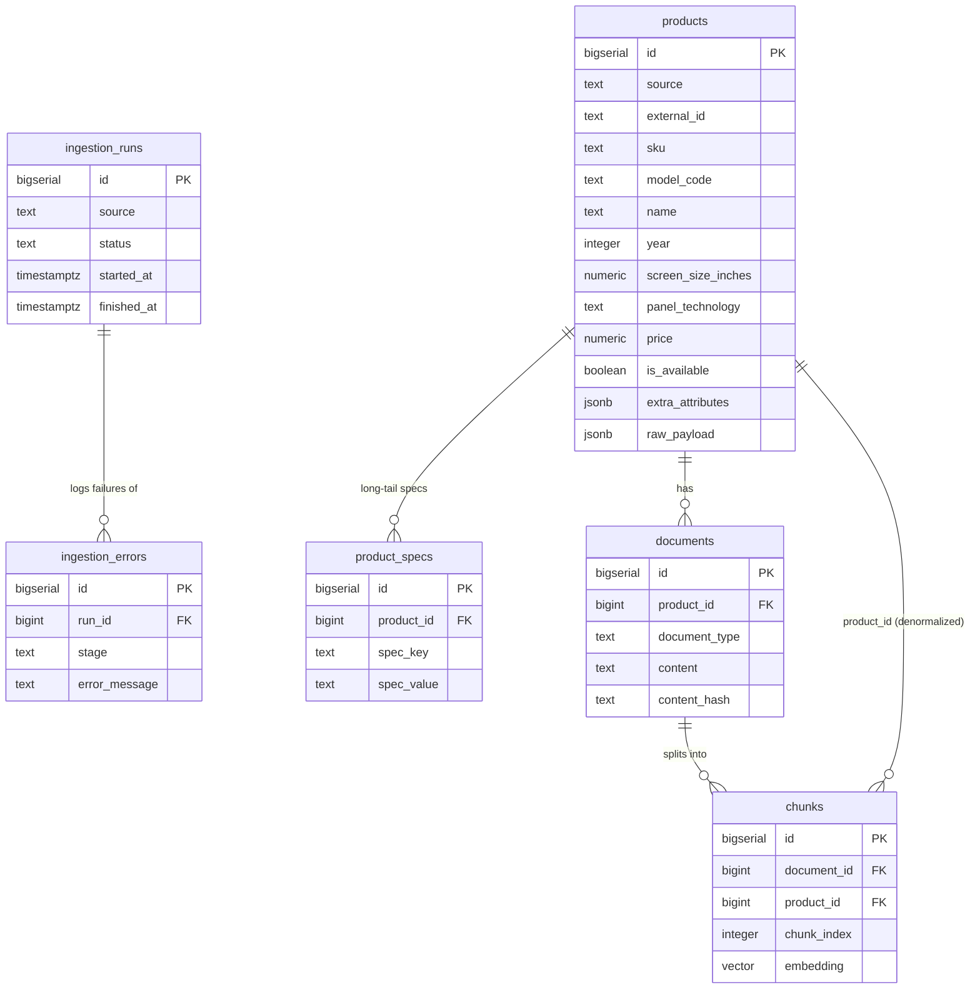

# Samsung RAG — Database Schema

PostgreSQL + pgvector schema for the Samsung TV AI Consultant v2 rebuild.
Targets the `samsung_rag` database on the VPS (`n8n-compose-postgres-1`,
`pgvector/pgvector:0.8.6-pg16-bookworm`, PostgreSQL 16). This is a
**separate database** from the pre-existing `finance_tracker` database on
the same PostgreSQL instance — nothing here ever touches `finance_tracker`,
and pgvector is enabled only in `samsung_rag`.

This phase (Phase 1) ships schema and migrations only. There is no
ingestion workflow and no AI Agent yet — see `docs/adr/001-samsung-rag-storage.md`
for the architecture decision and what is deliberately deferred.

## Why not the legacy SuperRAG schema

The legacy `SuperRAG Agent` n8n workflow (exported for reference at
`workflows/legacy/superrag-agent.sanitized.json`) is the generic n8n "chat with your
Google Drive files" community template: it ingests arbitrary PDF/CSV/Excel
files and stores everything as either full-text chunks in a `documents`
table or, for tabular files, one row per spreadsheet row in
`document_rows(dataset_id, row_data jsonb)`. There is no product entity at
all — a "dataset" is a Google Drive file, not a TV.

That's a fine universal prototype, but it can't support typed filtering
("QLED TVs under 55\" in stock") without parsing JSONB on every query, and
it has no concept of a canonical product, ingestion history, or lifecycle.
This schema replaces it with a domain-oriented model: typed columns for
what the AI Consultant needs to filter/compare on, JSONB only for
long-tail/raw data. See the ADR for the full reasoning.

One thing *is* carried over deliberately: the embedding model and vector
dimension. The legacy workflow's `Embeddings OpenAI1` node uses
`text-embedding-3-small`, and its `match_documents` function declares
`vector(1536)`. This schema uses the same `vector(1536)`, both because
1536 already worked in production and because changing embedding models
later is a re-embedding project, not a config change.

## Tables

- **`ingestion_runs`** — one row per ingestion pipeline execution (a
  catalog scrape, a re-index, ...). `status` is constrained to
  `running | success | partial | failed`. Counters
  (`products_discovered/inserted/updated/failed`) are maintained by the
  ingestion pipeline, not by triggers.
- **`ingestion_errors`** — per-item ingestion failures, FK'd to the run
  that produced them (`ON DELETE CASCADE` — deleting a run's history
  deletes its errors with it).
- **`products`** — canonical Samsung TV catalog. See "Canonical product
  identity" and "Typed columns vs JSONB" below.
- **`product_specs`** — long-tail characteristics that don't warrant a
  typed column on `products` (see below). One row per
  `(product_id, spec_key)`.
- **`documents`** — RAG document abstraction. One product can have several
  documents distinguished by `document_type`
  (`product_overview | specifications | comparison_context`), but at most
  one *current* document per `(product_id, document_type)` — re-ingestion
  updates that row in place rather than accumulating duplicates.
- **`chunks`** — chunk-level retrieval storage, one row per chunk with its
  own `embedding vector(1536)`. `product_id` is denormalized from
  `documents.product_id` and kept in sync automatically by a trigger (see
  "Why chunks has its own product_id" below), so vector search can filter
  on structured product attributes with a single join, and so ingestion
  code never has to pass `product_id` explicitly or risk it drifting from
  its document.



## Canonical product identity

**Decision: `UNIQUE (source, external_id)`, where `external_id` is the
source site's own internal product id.**

The legacy `Parsing` workflow (`workflows/legacy/parsing.sanitized.json`) extracts,
per product: `id`, `mpn`, `sku`, `name`, `brand`, `category`, `price`,
`salePrice`, `currency`, `stock`, `url`, `image`, `specs_text`. Its Google
Sheets "Append or update row" nodes use **`id`** — the site's own internal
product id (`window.digitalData.product.id` / `productId`) — as the
matching column against both the URL list and the final `products` sheet.
That's the one field the legacy pipeline already trusted as stable and
unique, so this schema continues that decision rather than guessing at a
new one.

Two caveats, documented rather than silently assumed:

- The legacy code sets `sku = ddp?.id`, i.e. its "sku" field is actually a
  *copy* of the same site-internal id, not a distinct SKU. This schema's
  `products.sku` column is reserved for a genuine SKU if a future
  ingestion phase can source one from Samsung directly; it is **not**
  part of the identity constraint.
- `mpn` (manufacturer part number, e.g. a real Samsung model string like
  `QE55Q60D`) maps to `products.model_code`. It looks like the more
  "official" identifier, but the legacy pipeline never relied on it for
  matching, and nothing in the available legacy artifacts confirms it is
  always present or stable across catalog re-scrapes. It is kept as a
  typed, indexed column for lookup/display, but **not** as the identity
  constraint, until a future ingestion phase can verify its reliability
  against a full catalog crawl.

`source` scopes `external_id` because the same numeric id scheme is not
guaranteed to stay unique if a second source (a different Samsung retailer
site, a manufacturer feed, ...) is ever ingested.

## Typed columns vs JSONB

Per the task brief: typed columns are for the attributes the AI
Consultant will actually filter or compare on — year, screen size,
resolution, panel technology, refresh rate, price, availability. The
legacy `Parsing` workflow does not currently extract these as separate
fields (they live inside the free-text `specs_text` built from the
site's grouped specifications block); a future ingestion phase is
expected to parse them out. This migration set adds the *columns* now so
that phase has somewhere typed to write to, without inventing a parsing
ruleset today.

Everything else — long-tail or non-standard characteristics scraped from
a product's spec table — goes into `product_specs` as
`(spec_group, spec_name, spec_key, spec_value, normalized_value, unit)`
rows, or into `products.extra_attributes` for looser, ungrouped data.
`products.raw_payload` exists purely for debugging/audit: the full
as-scraped payload, untouched.

`spec_key` is meant to be a stable, machine-generated slug (e.g.
`hdr_formats`) distinct from `spec_name`, the human-readable label as
scraped (which may be in Russian, per the source site). Generating
`spec_key` from `spec_name` is an ingestion-phase concern; this schema
only reserves the column and enforces `UNIQUE (product_id, spec_key)`.

## Lifecycle

`first_seen_at` / `last_seen_at` / `is_available` model product lifecycle
without ever physically deleting a product that disappears from a given
catalog run. A future ingestion phase is expected to: on each run, update
`last_seen_at` for every product still present, and flip `is_available`
to `false` (without deleting) for any previously-seen product absent from
the new run.

## Where does parser/ingestion state live?

Deliberately **not** on `products`. The task brief calls for
`parse_status` / `parse_errors` / `parsed_at` in a future ingestion phase,
and asks where that state should live. Decision: `ingestion_runs` /
`ingestion_errors` (this schema) and/or a staging layer a future phase may
add — never on the canonical `products` row. `products` stays a clean
"what do we currently believe about this TV" table; anything about *how*
or *when* or *how well* it was parsed belongs to the ingestion process
that produced it, which already has its own tables here.

## Embedding model / vector search

- Model: OpenAI `text-embedding-3-small`, dimension 1536 (continuing the
  decision already made by the legacy SuperRAG Agent workflow — see
  above). `chunks.embedding_model` is stored per-chunk so a future
  migration to a different model doesn't silently mix incompatible
  vectors.
- `match_product_chunks(query_embedding, match_count, filter_year,
  filter_min_screen_size, filter_max_screen_size, filter_panel_technology,
  filter_min_price, filter_max_price, filter_is_available)` — cosine
  distance (`<=>`) over `chunks.embedding`, joined to `products` for
  filtering, returning `similarity = 1 - distance` (same convention as
  the legacy `match_documents`). Typed, named parameters instead of a
  generic `filter jsonb` blob: self-documenting, type-checked by
  PostgreSQL at call time, and no dynamic SQL. This is not a hybrid
  (vector + keyword) search engine — Phase 1 only builds the vector-search
  primitive a later phase can build hybrid retrieval on top of.

## Indexing strategy

Btree indexes on every column the ingestion pipeline or the agent's SQL
tools are expected to filter/join on: `products.external_id`,
`model_code`, `product_url`, `year`, `screen_size_inches`,
`panel_technology`, `price`, `is_available`, plus the FK columns on
`product_specs`, `documents`, `chunks`, and `ingestion_errors`.

**No pgvector ANN index (ivfflat/hnsw) yet.** The Samsung TV catalog is a
few hundred products, so at most a few thousand chunks — a sequential
scan over `chunks.embedding` at that size is fast and always exact,
whereas ivfflat/hnsw trade exactness for speed and need a representative
data distribution to tune (`lists`/`m`/`ef_construction`) well. This is a
deliberate decision, not an oversight: add an `hnsw` index once real chunk
volume from a production ingestion run is known.

## Re-indexing

`documents` enforces one current row per `(product_id, document_type)`.
Re-ingestion is expected to `INSERT ... ON CONFLICT (product_id,
document_type) DO UPDATE` the document (bumping `content_hash` and
`updated_at`), then replace its chunks — e.g. delete the document's
existing chunks and re-insert, since chunk boundaries can shift when
source content changes. `chunks.embedding_model` lets a future
re-embedding migration identify which chunks still need re-embedding
under a new model.

## Migrations

```
db/migrations/
  001_extensions.sql   -- CREATE EXTENSION vector; shared set_updated_at() trigger fn
  002_ingestion.sql    -- ingestion_runs, ingestion_errors
  003_products.sql     -- products, product_specs
  004_rag.sql           -- documents, chunks, chunks.product_id sync trigger
  005_functions.sql    -- match_product_chunks()
  006_indexes.sql       -- remaining indexes
```

Plain, numbered SQL files applied in order with `psql -f`, deliberately
**not** run through a migration framework (Flyway/Alembic/etc.) — nothing
like that is currently part of this stack, and introducing one is out of
scope for a schema-only phase. Every file is idempotent
(`CREATE ... IF NOT EXISTS`, `CREATE OR REPLACE FUNCTION`,
`DROP TRIGGER IF EXISTS` + `CREATE TRIGGER`), so re-running the full set
against a database that already has them is a safe no-op, not an error. A
future phase can introduce a tracked migration runner without changing
the SQL itself.

### Bootstrapping a new environment

Creating the `samsung_rag` database itself is a one-time, cluster-level
operation that happens **outside** these migrations (a migration file
runs against an already-selected database; `CREATE DATABASE` doesn't
belong inside that same connection/transaction). On the VPS this has
already been done — `samsung_rag` exists, owned by `n8n`, with the
`vector` extension already installed. For a fresh environment:

```sql
-- run once, connected to any existing database (e.g. postgres), as a
-- role with CREATEDB, before applying the migrations below
CREATE DATABASE samsung_rag OWNER n8n;
```

Then apply the migrations in order against `samsung_rag`:

```bash
for f in db/migrations/*.sql; do
  psql "$DATABASE_URL" -v ON_ERROR_STOP=1 -f "$f"
done
```

### Local verification (disposable Docker container)

`db/test/run_local_tests.sh` spins up a throwaway
`pgvector/pgvector:0.8.6-pg16-bookworm` container (the same image family
as the VPS), applies every migration twice (to prove idempotency), loads
`db/seed/001_smoke_test_data.sql` (synthetic Samsung OLED / Neo QLED /
QLED test rows — **not** real product data), and runs
`db/test/assertions.sql`, which checks: all expected tables exist, the
`vector` extension is installed, the `ingestion_runs.status` CHECK fires,
the `products (source, external_id)` UNIQUE constraint fires, the
`chunks.document_id` FK fires, `ON DELETE CASCADE` removes documents and
chunks when their product is deleted, the `chunks.product_id` sync
trigger stays consistent, `vector(1536)` accepts embeddings,
`match_product_chunks` returns rows and ranks a synthetic nearest
neighbour correctly, and its structured-attribute filtering works. The
container is removed automatically on exit (`trap cleanup EXIT`),
regardless of pass/fail.

```bash
db/test/run_local_tests.sh
```

Requires Docker. If the Docker CLI's active context doesn't reach a
running daemon (e.g. it points at Docker Desktop but the system daemon on
`/var/run/docker.sock` is what's actually running), set
`DOCKER_HOST=unix:///var/run/docker.sock` before running the script.

### Verification actually performed for Phase 1

For this phase, schema verification was run twice:

1. Locally, against a disposable Docker container, via
   `db/test/run_local_tests.sh` as described above.
2. Against the real `samsung_rag` database on the VPS
   (`n8n-compose-postgres-1`), **with explicit one-time authorization**
   from the project owner to use it as the verification target instead of
   (or in addition to) the local container. That run: confirmed
   `samsung_rag` already existed (owner `n8n`), empty, with the `vector`
   extension already installed; applied all six migrations; loaded the
   same synthetic smoke-test dataset; ran the same `assertions.sql` (all
   10 checks passed); re-applied all six migrations a second time to
   confirm idempotency against a real instance; then deleted the
   synthetic smoke-test rows, leaving the production schema in place with
   zero data rows in every table. `finance_tracker` was never queried or
   modified. See the Phase 1 final report for the exact commands and
   results.

Routine future verification should use the local Docker path; applying
anything to the VPS again requires the same kind of explicit,
scoped authorization each time — it is not a standing default for this
repository.

## Rollback / safety

There is no `DROP`/rollback script by design, matching this repository's
existing safety posture (see the top-level `README.md`: no delete
anywhere in the n8n tool). Rolling back Phase 1 schema on a real
environment is a manual, reviewed operation (e.g. `DROP TABLE ... CASCADE`
in the correct dependency order), not an automated one, since it is
inherently destructive and this schema has no data-retention story yet.
All migrations here are additive/idempotent — none of them ever drop or
alter an existing column or table.
