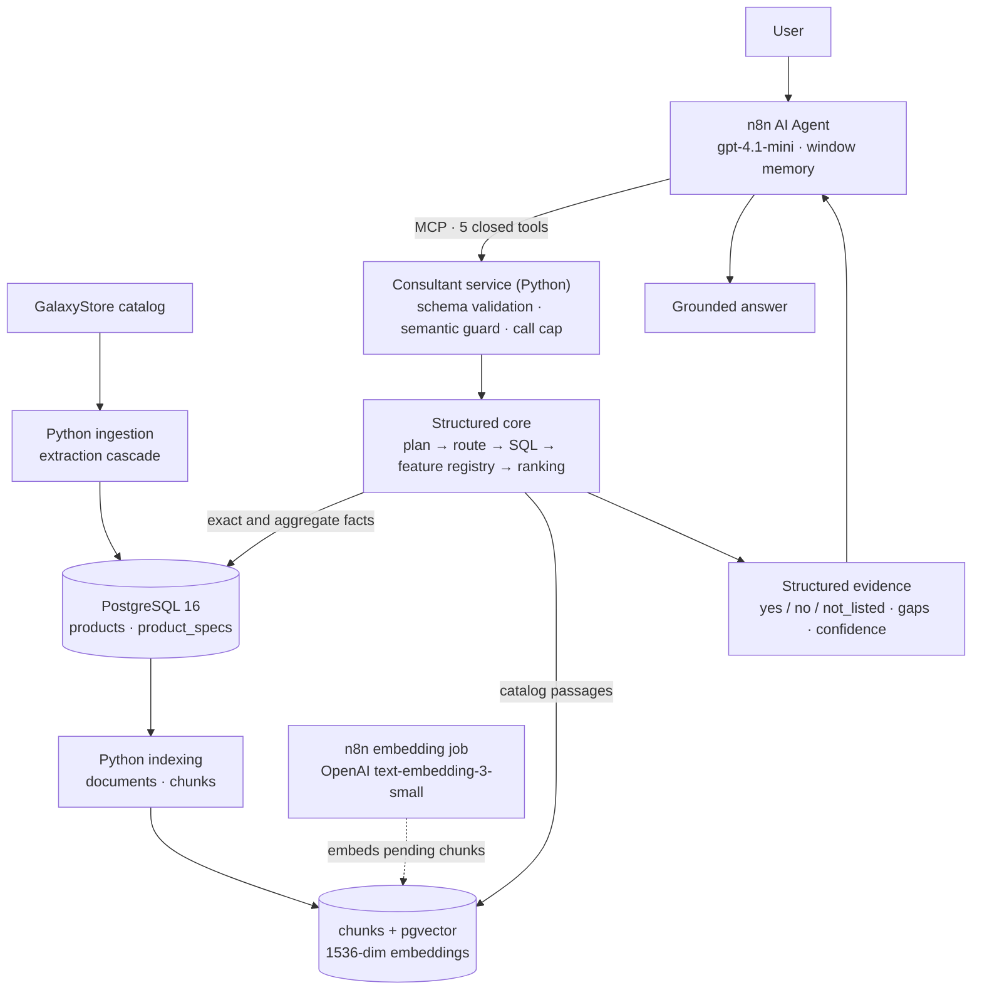

# Samsung AI Consultant — Architecture

The accepted architecture of the finished backend, as built and deployed (`samsung-consultant:4f3f`). This is the
canonical description. The phase documents next to it are the engineering record of how it got here, kept as
written; where they differ from this document, this document describes the current system.

> **Design principle.** The LLM is not the source of catalog truth. Structured tools and retrieved evidence are.

The frozen values of the deployed system (counts, versions, image, model) are in
[PROJECT_CLOSURE.md](PROJECT_CLOSURE.md).

| Layer | Runs as | Owns |
|---|---|---|
| Ingestion (`ingestion/`) | Python CLI, run by the operator | what is in the catalog tables |
| Indexing (`indexing/`) | Python CLI, run by the operator | documents and chunks |
| Embedding job (`workflows/rag-indexing.json`) | n8n workflow | vectors of pending chunks |
| Consultant service (`consultant/`) | internal Docker service | every catalog fact an answer may contain |
| Agent (`workflows/ai-consultant.json`) | n8n workflow | conversation, tool choice, wording |

---

## 1. Ingestion

`ingestion/` crawls the GalaxyStore Samsung TV catalog and writes it into PostgreSQL. No LLM is involved.

- **Extraction cascade.** Each page offers four structured sources, read in a fixed order: `JSON-LD`
  (manufacturer SKU, name, price, availability) → `window.digitalData` (the shop's product id, category, stock) →
  `SM_PARAMS` (the full specification tree) → an HTML fallback for a few page-level fields. Field precedence is
  fixed and documented; the sources that contributed are stored with the product.
- **Canonical identity** is `(source, external_id)`, the shop's own product id. The model code is unique in this
  catalog and is what users and tools use, but it is not the key.
- **Idempotent.** Products are upserted on the identity; specification rows are replaced per product. Crawling
  the same catalog twice yields the same products and specifications, with no duplicates (verified on the full
  catalog).
- **Audit.** Every run and every per-product error is recorded (`ingestion_runs`, `ingestion_errors`).

Details: [ingestion/README.md](../ingestion/README.md).

## 2. Storage

One PostgreSQL 16 database (`samsung_rag`) with the pgvector extension, separate from every other database on the
host. Decision record: [ADR 001](adr/001-samsung-rag-storage.md); schema: [db/README.md](../db/README.md).

| Table | Contents |
|---|---|
| `products` | one row per product: typed columns for what is filtered and compared exactly (category, panel technology, screen size, resolution, refresh rate, year, price, sale price, availability) and the raw payload |
| `product_specs` | the long tail: every specification row of the product page, grouped, with name and value |
| `documents` | one retrieval document per product |
| `chunks` | sections of a document, with `content_hash`, `embedding vector(1536)` and the embedding model |
| `ingestion_runs`, `ingestion_errors` | ingestion audit |

The effective price is `COALESCE(sale_price, price)`, defined once in the code and used by every query.

Three least-privilege roles, none a superuser, none with access to another database:

| Role | Used by | Grants |
|---|---|---|
| `samsung_ingestion` | ingestion | write on products, specs and the ingestion audit tables |
| `samsung_indexing` | indexing and the n8n embedding job | read on products and specs, write on documents and chunks |
| `samsung_consultant` | the Consultant service | `SELECT` on products, specs and chunks; sessions read-only by default; statement timeout |

## 3. Indexing

`indexing/` turns the stored rows into retrieval text by deterministic formatting. It calls no model.

- **One document per product**; up to **seven chunks** per document, one per section: `overview`, `display`,
  `gaming`, `audio`, `smart_features`, `connectivity`, `physical_design`. A section without specification content
  produces no chunk.
- Each chunk repeats a short identity preamble (name, model, category, section) so it is understandable on its own.
- Price and availability lines in chunk text are index-time values. The Consultant strips them from passages and
  always reads live values from `products`.

Decision record: [ADR 002](adr/002-rag-document-chunking-design.md); details:
[indexing/README.md](../indexing/README.md).

## 4. Embeddings

Embeddings are generated by an n8n workflow, `Samsung — RAG Indexing`, with the OpenAI credential that lives in
n8n. The key never reaches Python or this repository. The workflow starts from "chunks with no embedding" and
writes `text-embedding-3-small` vectors (1536 dimensions).

Rebuilding documents does not discard vectors. Chunks are matched by section, and
([ADR 003](adr/003-embedding-aware-chunk-sync.md)):

| Chunk after a rebuild | Stored vector |
|---|---|
| same `content_hash` | preserved, the row keeps its id |
| changed `content_hash` | reset to `NULL`; the next job run embeds it again |
| new chunk | pending (`NULL`) |
| chunk no longer produced | deleted |

A rebuild of an unchanged catalog therefore costs no embedding call.

## 5. Retrieval

Two mechanisms, kept as separate routes inside the core. A deterministic router picks the route from the typed
plan; the LLM cannot pick or influence it.

- **Structured (SQL).** Lists, lookups, comparisons, counts and extremes are parameterised queries over typed
  columns, built in exactly one module (`consultant/catalog_repository.py`) from allowlisted columns, sort keys and
  group keys, with hard row caps. Routes: `SQL_LOOKUP`, `SQL_FILTER`, `SQL_AGGREGATE`, `CONSTRAINT_FIRST`.
- **Semantic (chunks + pgvector).** `match_product_chunks()` is a filtered vector search; the core also has
  candidate-scoped and product-scoped vector routes and a global semantic fallback.

How they are used follows from the retrieval evaluation (Phase 3D, 21 cases on the production catalog): SQL was
exact on every structured and aggregate case, while vector search alone put the right product in the top five in
1 of 6 semantic cases. The chunks are short labelled specification lists, so similarity finds the right *section*
but does not rank products by the numbers that matter. The follow-up (Phase 4C) confirmed it: semantic retrieval
adds **evidence**, not **selection**.

In the deployed service:

- products are always **selected and ordered by the structured route**: filters, then the Feature Registry and a
  deterministic ranking for recommendations;
- chunks supply the **catalog passages** that accompany a named product (`get_tv`), read by section;
- **no query embedding is generated at runtime.** The service never calls OpenAI. A question that would need a
  vector lookup is answered from the product's specification rows, and the result says so in an explicit gap
  (`semantic_unavailable`) instead of treating a missing match as absence.

The vector routes are implemented and tested, and were evaluated with cached query embeddings. Turning them on at
runtime is an integration step, not a redesign, and was not needed for the accepted scope.

## 6. Consultant tools

The Consultant service exposes five tools and nothing else. Decision record:
[ADR 004](adr/004-agent-runtime-and-tool-boundary.md).

| Tool | Operation |
|---|---|
| `search_tvs` | list products matching explicit filters |
| `get_tv` | facts about one model code or family; optional attributes or a short feature question |
| `compare_tvs` | compare two to four named models or families |
| `recommend_tvs` | recommend for a use case and constraints, in a deterministic order |
| `get_catalog_stats` | exact counts (also per feature and per model family) and tie-aware extremes |

- **Closed contract.** Each tool has a closed JSON Schema, published to the agent and validated again in Python:
  unknown fields, wrong types and bad enum values are rejected with `invalid_arguments`, never coerced. No tool
  takes SQL, a filter expression, a vector, a weight or a ranking argument.
- **One pipeline.** Arguments become a typed plan and run through
  `planning → router → retrieval → evidence`. The agent receives a compact projection of the evidence.
- **Feature Registry.** Fourteen features (120 Hz, VRR, FreeSync tiers, ALLM, Game Bar, HDMI 2.1, eARC,
  anti-glare, Filmmaker Mode, Dolby Atmos, sound power, depth, VESA) are evaluated from specification rows into
  three states: `yes`, `no`, `not_listed`. `not_listed` means the catalog has no data. Every feature that was asked
  about is reported for every returned product, so "unknown" is shown instead of being absent.
- **Evidence, not just rows.** A result carries the applied constraints, per-product facts and feature states,
  explicit gaps (missing data, unknown models with nearest codes, excluded unavailable products), relaxation
  alternatives when nothing matches, a confidence label, and for counts the scope that was counted.
- **Semantic guard.** Before a tool runs, the guard compares the agent's hard constraints with what the user said
  in the conversation. A price, size or refresh-rate value that appears in no user message (digits, spelled or
  slang numbers) and a required feature the user never mentioned are removed and reported back as not applied.
  The guard only removes; it never adds or changes a value. It keeps derived facts of the messages, not their text.
- **Per-turn cap.** At most three tool calls per user message, enforced in Python.

## 7. Agent flow

1. The user message arrives in the n8n workflow `Samsung — AI Consultant`.
2. The AI Agent (`gpt-4.1-mini`, temperature 0) reads the system prompt and the session's window memory (six turns)
   and decides whether catalog access is needed and which domain operation fits.
3. It calls a tool over MCP. The service validates the arguments, applies the guard and the cap, runs the pipeline
   in a read-only database session, and returns structured evidence.
4. The agent writes the answer from the evidence: model codes and prices copied exactly, availability stated,
   `not_listed` worded as «в каталоге нет данных», gaps mentioned, a clarifying question when the result says the
   request is under-specified.

The agent owns the conversation, the choice of operation and the wording. Python owns validation, SQL, the
registry, ranking, the effective price, availability semantics and product identity.

**Known limitation of this split.** The guard acts on tool arguments, not on the answer text. After a vague or
relative request («подешевле», «не огромный») the model may invent a numeric threshold; the guard keeps it out of
the query, but the model can still word the answer by that number («до 50 000 ₽»). There is no check of the
answer after generation.

## 8. n8n orchestration

n8n is the orchestrator, not a data builder and not a source of truth.

| Workflow | Role |
|---|---|
| `Samsung — RAG Indexing` | embeds pending chunks and stores the vectors |
| `Samsung — RAG Retrieval Smoke Test` | a one-off query → embedding → `match_product_chunks()` check |
| `Samsung — AI Consultant` | chat trigger, AI Agent, OpenAI chat model, per-session window memory, MCP client tool |

- Workflows are code: the JSON in `workflows/` is deployed with `tools/n8n-tool`, which validates, scans for
  secrets, backs up the remote version before each update and verifies by reading back. The Consultant workflow
  is generated from the system prompt and the tool schemas (`python -m consultant.n8n_workflow`); a check fails
  when the committed file is stale.
- The MCP endpoint URL carries the execution id (the per-turn cap), the session id and the user message (the
  guard's context). The message is redacted from the service's request log.
- The Consultant workflow is deployed **inactive**: it is driven from the n8n editor chat and by the evaluation
  drivers. No public chat channel is attached.

Details: [workflows/README.md](../workflows/README.md).

## 9. Evaluation

Every stage was measured before the next was built, and the evidence is committed
([evaluation/README.md](../evaluation/README.md)).

| Stage | Method | Outcome |
|---|---|---|
| Retrieval (3D) | 21 cases on the production catalog; SQL, vector and hybrid baselines; two LLM context spikes | structured selection, semantic evidence |
| Structured core and evidence (4B, 4C) | gold plans, read-only evaluation against production | deterministic behaviour fixed by tests |
| Agent (4D) | 42 cases through the live agent, manual verdicts | 40 of 42, 0 incorrect product facts |
| Semantic guard (4E) | offline replay of recorded tool calls, then live confirmation | invented constraints removed, stated ones kept |
| Model bake-off | three models on the frozen runtime, 246 scored turns | `gpt-4.1-mini` kept |
| Product acceptance (4F.1, 4F.2) | 15 multi-turn scenarios, strict rubric, manual review, confirmation run | **HOLD**: 4 of 15 passed |
| MVP demo (4F.3) | three targeted fixes measured as rates over repeated sessions; 8 demo conversations | **7 of 8** |
| Hotfix (4F.3A) | reject-and-retry for an invented number, verified live | failed, reverted |

Reports are generated from committed evidence, and their `--check` commands fail when a generated file is stale.
Historical results are never edited.

## 10. Deployment and safety

- **Internal service.** The Consultant runs as one container on the existing Docker network of n8n: no published
  port, no reverse-proxy route, read-only root filesystem, all capabilities dropped, no volumes, no Docker socket.
  It is a separate Compose project, so deploying it never recreates n8n, PostgreSQL, Redis or Traefik.
- **Authentication.** A bearer token, compared in constant time; an `Origin` allowlist; a 64 KiB request cap.
- **Read-only data access.** The service connects as `samsung_consultant` in read-only sessions with a statement
  timeout. It cannot write, and it never generates embeddings.
- **Secrets.** Database password and token live only in an env file on the host (mode 600, git-ignored). They are
  generated there and piped between processes; they are never printed, exported or committed. The OpenAI
  credential lives only in n8n.
- **Reproducible build.** The image is built from a committed revision and labelled with it; the files in the
  image and in the running container are compared with the repository.
- **Verification.** Probes run through the same network path as the agent (`mcp_probe.js`, `guard_probe.js`,
  `mvp_probe.js`), and `catalog_fingerprint.py` shows that a deployment or cleanup left the catalog unchanged.
- **Logging.** The service logs tool names, statuses, argument names and guard decisions. It does not log user
  text, tokens or connection strings.

Runbook and rollback: [deploy/consultant/README.md](../deploy/consultant/README.md).

---

## Engineering record

| Document | Phase |
|---|---|
| [ADR 001](adr/001-samsung-rag-storage.md), [002](adr/002-rag-document-chunking-design.md), [003](adr/003-embedding-aware-chunk-sync.md), [004](adr/004-agent-runtime-and-tool-boundary.md) | storage, chunking, embedding-aware sync, agent boundary |
| [phase-3d-retrieval-evaluation.md](phase-3d-retrieval-evaluation.md) | retrieval evaluation |
| [PHASE_4A_AI_CONSULTANT_ARCHITECTURE.md](PHASE_4A_AI_CONSULTANT_ARCHITECTURE.md) | the design before implementation; amended by ADR 004 |
| [PHASE_4B_STRUCTURED_CORE.md](PHASE_4B_STRUCTURED_CORE.md), [PHASE_4C_EVIDENCE_SEMANTIC.md](PHASE_4C_EVIDENCE_SEMANTIC.md) | structured core, evidence and semantic retrieval |
| [PHASE_4D_AGENT_RUNTIME.md](PHASE_4D_AGENT_RUNTIME.md) | agent tools, n8n runtime, live agent evaluation |
| [PHASE_4E_QUERY_SEMANTICS.md](PHASE_4E_QUERY_SEMANTICS.md) | query semantics and the semantic guard |
| [MODEL_BAKEOFF.md](MODEL_BAKEOFF.md) | model comparison |
| [PHASE_4F_PRODUCT_ACCEPTANCE.md](PHASE_4F_PRODUCT_ACCEPTANCE.md) | acceptance design and the 4F.2 result |
| [PHASE_4F_3_MVP_HARDENING.md](PHASE_4F_3_MVP_HARDENING.md) | MVP hardening, the demo suite, the reverted 4F.3A hotfix |
| [workflows/legacy/](../workflows/legacy/) | sanitized exports of the two earlier n8n prototypes this project replaced (reference only) |
