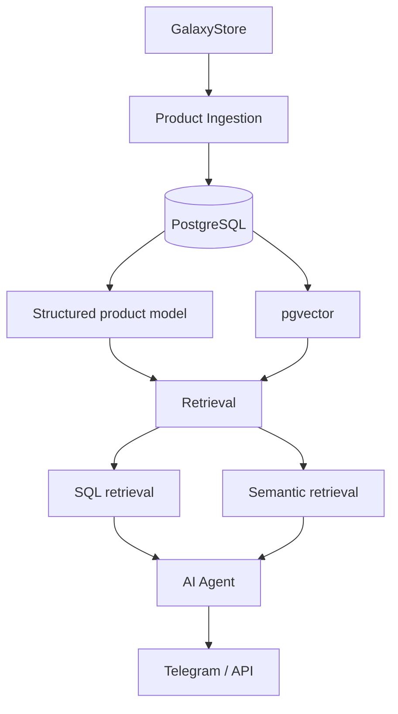

# Samsung AI Consultant

An AI product consultant for Samsung TVs, grounded in real catalog data
via a structured PostgreSQL model and pgvector-backed retrieval.

## Problem

Give a user accurate, product-grounded answers about the current Samsung
TV lineup — filtering and comparing on real attributes (size, panel
technology, price, availability) as well as answering open-ended
questions — instead of relying on an LLM's own (unreliable, stale)
knowledge of the catalog.

## Architecture target



Retrieval is deliberately hybrid: typed SQL for attributes the agent
should filter/compare on exactly (year, screen size, panel technology,
price, availability), and pgvector semantic search over product
documents for open-ended questions. See
[docs/adr/001-samsung-rag-storage.md](docs/adr/001-samsung-rag-storage.md)
for the full reasoning behind that split.

## Current status

```text
Phase 1 — Database Schema & Migrations: COMPLETE
Phase 2 — Product Ingestion:            NEXT
Phase 3 — RAG Indexing:                 PLANNED
Phase 4 — AI Consultant:                PLANNED
Phase 5 — Evaluation / Observability:   PLANNED
```

Phase 1 shipped the PostgreSQL + pgvector schema and migrations only —
see [db/README.md](db/README.md) for the schema, design decisions, and
how to run the local verification suite. There is no ingestion pipeline
and no AI agent yet.

## Legacy

This project evolves two earlier n8n prototypes, preserved here as
sanitized reference workflows (credentials stripped) rather than treated
as throwaway history:

- [`workflows/legacy/parsing.sanitized.json`](workflows/legacy/parsing.sanitized.json) —
  the existing Samsung catalog scraper, still the source of truth for
  which fields a future ingestion phase can extract.
- [`workflows/legacy/superrag-agent.sanitized.json`](workflows/legacy/superrag-agent.sanitized.json) —
  a generic n8n "chat with your Google Drive files" RAG template, adapted
  with a Samsung persona. Useful as a reference implementation, but not
  the foundation this project builds on — see the ADR for why.

Both were inspected directly via the read-only [n8n Tool](../../tools/n8n-tool/)
CLI in this repository as part of Phase 1's design decisions, rather than
assumed from memory.

## Repository layout

```text
projects/samsung-ai-consultant/
├── db/                 # PostgreSQL + pgvector schema, migrations, local tests
├── docs/adr/           # architecture decision records
└── workflows/legacy/   # sanitized reference exports of prior n8n prototypes
```
