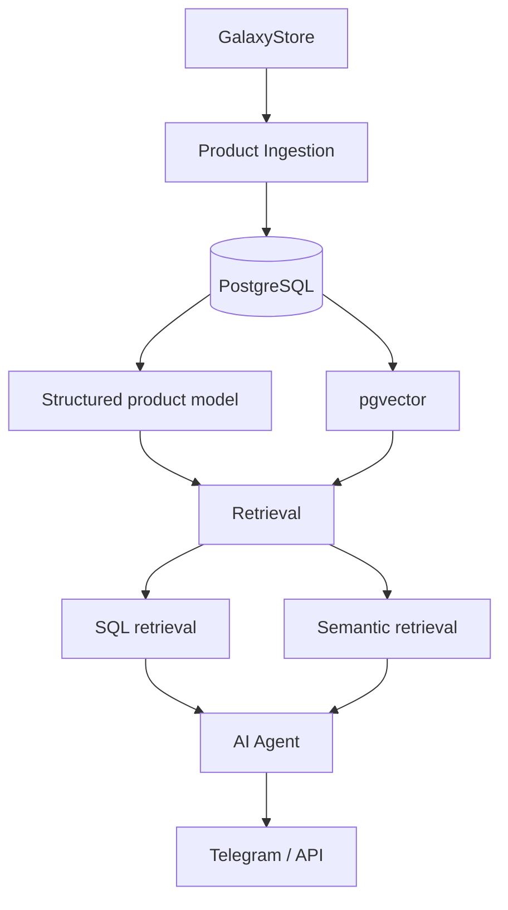

# Samsung AI Consultant

An AI product consultant for Samsung TVs, grounded in real catalog data
via a structured PostgreSQL model and pgvector-backed retrieval.

## Problem

Give a user accurate, product-grounded answers about the current Samsung
TV lineup — filtering and comparing on real attributes (size, panel
technology, price, availability) as well as answering open-ended
questions — instead of relying on an LLM's own (unreliable, stale)
knowledge of the catalog.

## Architecture target



Retrieval is deliberately hybrid: typed SQL for attributes the agent
should filter/compare on exactly (year, screen size, panel technology,
price, availability), and pgvector semantic search over product
documents for open-ended questions. See
[docs/adr/001-samsung-rag-storage.md](docs/adr/001-samsung-rag-storage.md)
for the full reasoning behind that split.

## Current status

```text
Phase 1 — Database Schema & Migrations:        COMPLETE
Phase 2 — Product Ingestion:                   COMPLETE (full catalog crawled and retained; n8n orchestration still pending)
Phase 3A — Document & Retrieval Design:        COMPLETE (no embeddings yet)
Phase 3B — Embeddings & Vector Retrieval:      COMPLETE (n8n embeddings workflow + retrieval smoke test)
Phase 3B.1 — Embedding-aware chunk sync:       COMPLETE (incremental rebuild preserves embeddings)
Phase 3C — Full-catalog RAG indexing:          COMPLETE
Phase 3D — Retrieval evaluation:               COMPLETE (baseline + consultant spikes; see docs/phase-3d-retrieval-evaluation.md)
Phase 4A — AI Consultant architecture:         COMPLETE (docs/PHASE_4A_AI_CONSULTANT_ARCHITECTURE.md)
Phase 4B — Structured Consultant core:         COMPLETE (no LLM/embeddings; docs/PHASE_4B_STRUCTURED_CORE.md)
Phase 4C — Evidence & semantic retrieval:      COMPLETE (no LLM/new embeddings; docs/PHASE_4C_EVIDENCE_SEMANTIC.md)
Phase 4D — Agent tools & n8n runtime:          4D.1 + 4D.2A COMPLETE (internal MCP service deployed; live Agent eval pending approval)
Phase 4E.1 — Query-semantics spike:           EVALUATED (isolated, not integrated; docs/PHASE_4E_QUERY_SEMANTICS.md)
Phase 4E.2 — Semantic guard:                  ACTIVE (live 42-case confirmation 44/44; docs/PHASE_4E_QUERY_SEMANTICS.md)
Phase 4E.2A — Restart-safe provenance:        FIXED + SMOKE-VERIFIED (not deployed; docs/PHASE_4E_QUERY_SEMANTICS.md)
Model bake-off gate:                          KEEP gpt-4.1-mini (measurement only; docs/MODEL_BAKEOFF.md)
Phase 4F.1 — Final product acceptance design: COMPLETE (15 scenarios, design only; docs/PHASE_4F_PRODUCT_ACCEPTANCE.md)
Phase 4F.2 / 4F.3 — live acceptance run, release decision: PENDING APPROVAL
Phase 4G — channel:                            PLANNED
Phase 5 — Evaluation / Observability:          PLANNED
```

Phase 1 shipped the PostgreSQL + pgvector schema and migrations — see
[db/README.md](db/README.md) for the schema, design decisions, and how to
run the local verification suite.

Phase 2 shipped a standalone, tested ingestion pipeline
(`ingestion/`, see [ingestion/README.md](ingestion/README.md)) that
scrapes the GalaxyStore Samsung TV catalog and persists it into the
Phase 1 schema, with a fixture-backed unit test suite, a
disposable-container repository/idempotency test suite
(`tests/run_db_tests.sh`), and a live full-catalog production run. The
complete configured catalog (3 pages, 75 products) was crawled twice
against the real `samsung_rag` database — 75/75 succeeded both times,
0 failures, confirmed idempotent (see "Full-catalog production run" in
[ingestion/README.md](ingestion/README.md) for counts, distributions, and
QA findings) — and **the resulting 75 products / 4151 spec rows are
retained as production data**, not test rows.

Phase 3A shipped a deterministic `documents`/`chunks` builder
(`indexing/`, see [indexing/README.md](indexing/README.md) and
[docs/adr/002-rag-document-chunking-design.md](docs/adr/002-rag-document-chunking-design.md))
that turns `products`/`product_specs` into RAG-ready document/chunk text
and metadata — **no embeddings API calls, `embedding` stays `NULL`**.
Verified against the full real 75-product corpus and a small production
integration test (persisted, verified, then cleaned back to
`documents: 0 / chunks: 0`). A 21-case retrieval evaluation dataset
(`evaluation/retrieval_cases.json`) grounded entirely in real catalog
data is the baseline for Phase 3B.

Phase 3B added two n8n workflows (`workflows/rag-indexing.json`,
`workflows/rag-retrieval-smoke-test.json` — see
[workflows/README.md](workflows/README.md) for full architecture,
node-by-node responsibilities, and discovered limitations) that call a
real OpenAI embeddings credential entirely from inside n8n — the
credential never touches Python or this repository. Document/chunk
*construction* stays in the tested Python `indexing/` package, run
out-of-band; the n8n workflows start from "chunks with no embedding yet."
A single real product (`QE65S95HAUXPY`) was indexed end-to-end (1
document, 7 chunks, real 1536-dim `text-embedding-3-small` vectors),
verified idempotent across three executions, and a retrieval smoke test
against `match_product_chunks()` returned sensible, correctly-ranked
results. **The full catalog has not been indexed and the AI Agent has
not started** — this phase stopped at its review gate by design.

Phase 3B.1 fixed a real regression discovered from that acceptance test:
Phase 3A's chunk persistence deleted and re-inserted every chunk on
every rebuild, silently discarding real embeddings the moment they
existed. `indexing/repository.py`'s `sync_chunks` (see
[docs/adr/003-embedding-aware-chunk-sync.md](docs/adr/003-embedding-aware-chunk-sync.md))
now matches chunks by logical section and only clears an embedding when
its `content_hash` actually changed. Verified against the real
`QE65S95HAUXPY` production row (rebuilt live — all 7 embeddings preserved
byte-for-byte) and against a disposable database for the changed/new/
removed-chunk cases. Still only one product indexed; full catalog and
the 21-case benchmark remain not run.

## Legacy

This project evolves two earlier n8n prototypes, preserved here as
sanitized reference workflows (credentials stripped) rather than treated
as throwaway history:

- [`workflows/legacy/parsing.sanitized.json`](workflows/legacy/parsing.sanitized.json) —
  the existing Samsung catalog scraper, still the source of truth for
  which fields a future ingestion phase can extract.
- [`workflows/legacy/superrag-agent.sanitized.json`](workflows/legacy/superrag-agent.sanitized.json) —
  a generic n8n "chat with your Google Drive files" RAG template, adapted
  with a Samsung persona. Useful as a reference implementation, but not
  the foundation this project builds on — see the ADR for why.

Both were inspected directly via the read-only [n8n Tool](../../tools/n8n-tool/)
CLI in this repository as part of Phase 1's design decisions, rather than
assumed from memory.

## Repository layout

```text
projects/samsung-ai-consultant/
├── db/                 # PostgreSQL + pgvector schema, migrations, local tests
├── docs/adr/           # architecture decision records
├── consultant/          # Phase 4B: deterministic structured Consultant core (Python, read-only)
├── evaluation/          # retrieval_cases.json -- Phase 3B evaluation baseline
├── ingestion/          # Phase 2: GalaxyStore catalog ingestion pipeline (Python)
├── indexing/            # Phase 3A: documents/chunks builder (no embeddings) (Python)
├── tests/              # unit tests + fixtures + disposable-DB test runner (both pipelines)
├── workflows/          # Phase 3B: n8n RAG indexing + retrieval-smoke-test workflows (sanitized JSON)
└── workflows/legacy/   # sanitized reference exports of prior n8n prototypes
```

## Database access

Each pipeline connects to `samsung_rag` as its own least-privilege
Postgres role — created directly via `docker exec psql` on the VPS,
**never** by extracting the `n8n` role's own credential, and never reusing
one pipeline's role for another:

- **`samsung_ingestion`** (Phase 2): `SELECT/INSERT/UPDATE` on `products`
  and `ingestion_runs`, `SELECT/INSERT/UPDATE/DELETE` on `product_specs`,
  `SELECT/INSERT` on `ingestion_errors`, plus `USAGE`/`SELECT` on those
  four tables' sequences. No access to `documents`/`chunks`.
- **`samsung_indexing`** (Phase 3A/3B): `SELECT` only on `products` and
  `product_specs` (read-only — this pipeline never writes ingestion's
  tables), full `SELECT/INSERT/UPDATE/DELETE` on `documents` and
  `chunks`, plus `USAGE`/`SELECT` on their sequences. This is the role
  behind the n8n credential **`Samsung RAG PostgreSQL`**, created
  manually by the project owner for Phase 3B's n8n workflows — its
  password was never requested, read, or reset by this codebase.

A third, temporary role (`samsung_indexing_cli`) existed briefly during
Phase 3B for this codebase's own local CLI verification, so local tooling
never had to know or touch the password behind the n8n-linked
`samsung_indexing` credential. It has since been **dropped** (Phase
3B.1, after confirming it owned no objects and had no dependents) once
it was confirmed nothing else referenced it — see the Phase 3B.1 final
report. Local CLI/test verification against a real database now uses
either a disposable Docker container (`tests/run_db_tests.sh`) or a
similarly-scoped role created fresh for the occasion, not a standing
credential.

Both `samsung_ingestion` and `samsung_indexing` are **not** superusers
and have **no** `CREATEDB`/`CREATEROLE`, and neither has any grant on
`finance_tracker`. See `ingestion/README.md` / `indexing/README.md` /
`workflows/README.md` and the Phase 2/3A/3B final reports for how each
was created and verified (role attributes +
`information_schema.role_table_grants` checked directly, not assumed).
`DATABASE_URL` / `INDEXING_DATABASE_URL` live only in a git-ignored local
`.env` (see `.env.example`), reached via
an SSH tunnel to the VPS's Postgres port (published to `127.0.0.1:5432`
on the VPS host only, not public).
