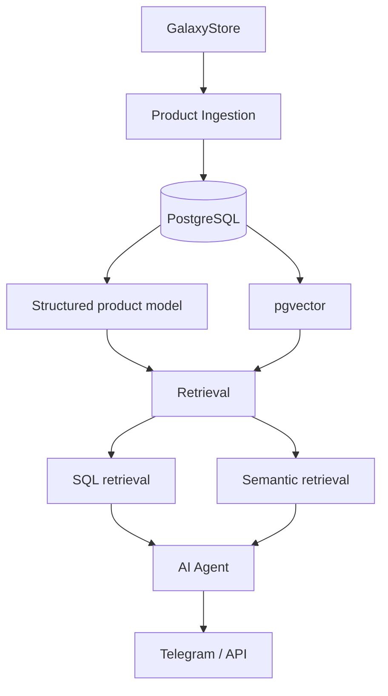

# Samsung AI Consultant

An AI product consultant for Samsung TVs, grounded in real catalog data
via a structured PostgreSQL model and pgvector-backed retrieval.

## Problem

Give a user accurate, product-grounded answers about the current Samsung
TV lineup — filtering and comparing on real attributes (size, panel
technology, price, availability) as well as answering open-ended
questions — instead of relying on an LLM's own (unreliable, stale)
knowledge of the catalog.

## Architecture target



Retrieval is deliberately hybrid: typed SQL for attributes the agent
should filter/compare on exactly (year, screen size, panel technology,
price, availability), and pgvector semantic search over product
documents for open-ended questions. See
[docs/adr/001-samsung-rag-storage.md](docs/adr/001-samsung-rag-storage.md)
for the full reasoning behind that split.

## Current status

```text
Phase 1 — Database Schema & Migrations: COMPLETE
Phase 2 — Product Ingestion:            IMPLEMENTED, PENDING REVIEW (full catalog crawl not yet run)
Phase 3 — RAG Indexing:                 PLANNED
Phase 4 — AI Consultant:                PLANNED
Phase 5 — Evaluation / Observability:   PLANNED
```

Phase 1 shipped the PostgreSQL + pgvector schema and migrations — see
[db/README.md](db/README.md) for the schema, design decisions, and how to
run the local verification suite.

Phase 2 shipped a standalone, tested ingestion pipeline
(`ingestion/`, see [ingestion/README.md](ingestion/README.md)) that
scrapes the GalaxyStore Samsung TV catalog and persists it into the
Phase 1 schema, with a fixture-backed unit test suite, a
disposable-container repository/idempotency test suite
(`tests/run_db_tests.sh`), a live-site dry-run, and a small controlled
integration test against `samsung_rag` (rows removed afterward — see the
Phase 2 final report). **The full catalog has not yet been crawled** —
that (and any n8n orchestration around this pipeline) waits on human
review of this phase. There is no RAG indexing and no AI agent yet.

## Legacy

This project evolves two earlier n8n prototypes, preserved here as
sanitized reference workflows (credentials stripped) rather than treated
as throwaway history:

- [`workflows/legacy/parsing.sanitized.json`](workflows/legacy/parsing.sanitized.json) —
  the existing Samsung catalog scraper, still the source of truth for
  which fields a future ingestion phase can extract.
- [`workflows/legacy/superrag-agent.sanitized.json`](workflows/legacy/superrag-agent.sanitized.json) —
  a generic n8n "chat with your Google Drive files" RAG template, adapted
  with a Samsung persona. Useful as a reference implementation, but not
  the foundation this project builds on — see the ADR for why.

Both were inspected directly via the read-only [n8n Tool](../../tools/n8n-tool/)
CLI in this repository as part of Phase 1's design decisions, rather than
assumed from memory.

## Repository layout

```text
projects/samsung-ai-consultant/
├── db/                 # PostgreSQL + pgvector schema, migrations, local tests
├── docs/adr/           # architecture decision records
├── ingestion/          # Phase 2: GalaxyStore catalog ingestion pipeline (Python)
├── tests/              # ingestion unit tests + fixtures + disposable-DB test runner
└── workflows/legacy/   # sanitized reference exports of prior n8n prototypes
```

## Database access for ingestion

The ingestion pipeline connects to `samsung_rag` as its own least-privilege
Postgres role, `samsung_ingestion` — created directly via `docker exec psql`
on the VPS (never by extracting the `n8n` role's own credential). It is
**not** a superuser and has **no** `CREATEDB`/`CREATEROLE`, and its grants
are scoped to exactly `SELECT/INSERT/UPDATE` on `products` and
`ingestion_runs`, `SELECT/INSERT/UPDATE/DELETE` on `product_specs`,
`SELECT/INSERT` on `ingestion_errors`, plus `USAGE`/`SELECT` on those four
tables' sequences — nothing on `documents`/`chunks` (Phase 3) and nothing
on `finance_tracker`. See `ingestion/README.md` and the Phase 2 final
report for how this was created and verified. `DATABASE_URL` for this role
lives only in a git-ignored local `.env` (see `.env.example`), reached via
an SSH tunnel to the VPS's Postgres port (published to `127.0.0.1:5432`
on the VPS host only, not public).
